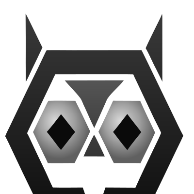

<div align="center">
  
  <h1>Noctuary Plugins</h1>
  <p>Vendor log plugins for the <a href="https://noctuary.io">Noctuary Agent</a> — pattern matching that runs on your own hardware.</p>
  <p>
    <a href="https://github.com/noctuary-io/noctuary-plugins/actions"></a>
    <a href="https://pkg.go.dev/github.com/noctuary-io/noctuary-plugins"></a>
    <a href="LICENSE"></a>
  </p>
</div>

---

## What this is

The Noctuary Agent watches your infrastructure logs — from your OTel Collector — and extracts meaningful signals: deploys, restarts, saturation events, dependency failures. It does all of this locally. Raw log lines never leave your network.

This repository contains the **plugin contract** and every **official vendor plugin**. Each plugin is a small, focused Go package that knows how to:

1. **Fingerprint** — quickly decide whether a log line looks like it came from a particular vendor
2. **Match** — extract a structured `ContextEvent` from lines that do

Plugins are compiled directly into the agent binary. No runtime config, no sidecar, no plugin server.

---

## Plugin catalogue

### Deployment & orchestration

| Plugin | Detects |
|---|---|
| **argocd** | Sync operations, health transitions, rollbacks, app deletions |
| **kubernetes** | Pod restarts, OOMKill, CrashLoopBackOff, node pressure, scale events |

### Databases

| Plugin | Detects |
|---|---|
| **postgres** | Slow queries, autovacuum, connection exhaustion, crash recovery, schema changes |
| **redis** | Memory eviction, bgsave failure, AOF rewrite errors, replica sync failures, OOM kills |

### Message queues

| Plugin | Detects |
|---|---|
| **kafka** | Broker elections, under-replicated partitions, consumer lag, ISR changes |

### Feature flags

| Plugin | Detects |
|---|---|
| **flagd** | Flag evaluations, configuration reloads, resolver errors |

### Logging frameworks

| Plugin | Vendor |
|---|---|
| **pino** | Node.js services using [pino](https://github.com/pinojs/pino) structured JSON logging |
| **log4j2** | JVM services using [Log4j 2](https://logging.apache.org/log4j/2.x/) |
| **gojson** | Go services emitting structured JSON (`level`, `msg`, `time`) |

### Catch-all

| Plugin | Notes |
|---|---|
| **generic** | Keyword heuristics for common error patterns — used when no vendor plugin matches |

---

## Getting an API key

Sign up at **[app.noctuary.io](https://app.noctuary.io)** and create a free account. Once logged in, go to **Settings → Agent & API Keys** and generate a key. It will look like:

```
nct_k1_xxxxxxxxxxxxxxxxxxxxxxxx
```

Keep it handy — you'll pass it to the installer or set it in `agent.yaml`. The agent runs in `stdout` mode without a key (useful for local testing), but you need one to send events to the Noctuary backend.

---

## Installing the agent

Plugins ship as part of the Noctuary Agent binary. Install the agent and all plugins are included.

### Bare metal (Linux)

```bash
curl -sSL https://install.noctuary.io/agent.sh | sudo bash
```

With your API key pre-configured:

```bash
NOCTUARY_API_KEY=nct_k1_your_key curl -sSL https://install.noctuary.io/agent.sh | sudo bash
```

The installer places the binary at `/usr/local/bin/noctuary-agent`, writes a default config to `/etc/noctuary/agent.yaml`, and registers a systemd service.

```bash
systemctl status noctuary-agent
journalctl -u noctuary-agent -f
```

### Docker

```bash
docker run --rm \
  -p 4318:4318 \
  -v /path/to/agent.yaml:/etc/noctuary/agent.yaml:ro \
  noctuary/agent:latest
```

### Kubernetes (Helm)

```bash
helm repo add noctuary https://charts.noctuary.io
helm install noctuary-agent noctuary/noctuary-agent \
  --set auth.apiKey.secretValue="nct_k1_your_key"
```

---

## Configuring plugins

By default all plugins are enabled. Disable any you don't need in `agent.yaml`:

```yaml
plugins:
  argocd:
    enabled: true
  kubernetes:
    enabled: true
  postgres:
    enabled: true
  redis:
    enabled: false   # not in this environment
  kafka:
    enabled: false
  flagd:
    enabled: true
  pino:
    enabled: true
  log4j2:
    enabled: false
  gojson:
    enabled: true
  generic:
    enabled: true
```

Restart the agent after any config change:

```bash
sudo systemctl restart noctuary-agent   # systemd
docker compose restart agent            # Docker Compose
```

---

## Connecting your OTel Collector

The agent listens on port `4318` for OTLP/HTTP/JSON. Add this to your Collector config:

```yaml
exporters:
  otlphttp/noctuary:
    endpoint: http://localhost:4318
    tls:
      insecure: true
    encoding: json      # required
    compression: none

service:
  pipelines:
    logs:
      receivers: [filelog]
      processors: [resource]
      exporters: [otlphttp/noctuary]
```

Set `service.name` so the agent can attribute events to the right service:

```yaml
processors:
  resource:
    attributes:
      - action: insert
        key: service.name
        value: my-postgres-primary
```

---

## Writing your own plugin

Copy `_template/myplugin/` into `plugins/<yourvendor>/` and implement two methods:

```go
// Fingerprints returns cheap rules that route log lines to your plugin.
func (p *Plugin) Fingerprints() []plugin.FingerprintRule {
    return []plugin.FingerprintRule{
        {Type: plugin.RuleTypeSubstring, Value: "my-distinctive-string", Weight: 0.9},
        {Type: plugin.RuleTypeRegex,     Value: `^\[MyVendor\]`,         Weight: 0.8},
    }
}

// Match extracts a ContextEvent from a line that passed fingerprinting.
// Return (nil, nil) for lines that are from this vendor but not a meaningful event.
func (p *Plugin) Match(line schema.ParsedOTelLog) (*schema.ContextEvent, error) {
    if strings.Contains(line.Body, "started") {
        return &schema.ContextEvent{
            EventType:  schema.EventTypeRestart,
            Vendor:     "myvendor",
            NewValue:   "started",
            Timestamp:  line.Timestamp,
            Confidence: 0.9,
            RawLine:    line.Body,
            TTLSeconds: 1800,
        }, nil
    }
    return nil, nil
}
```

Build and test your plugin:

```bash
go test ./plugins/myvendor/
make myvendor   # builds myvendor.wasm
```

To wire it into the agent, register it in the processor's `internal/pipeline/pipeline.go` and add it to the default config. See the [contribution guide](_template/myplugin/plugin.go) in the template for the full contract.

---

## Repository layout

```
noctuary-plugins/
├── plugin/              # VendorPlugin interface + FingerprintRule types
├── schema/              # ParsedOTelLog + ContextEvent types
├── plugins/
│   ├── argocd/
│   ├── flagd/
│   ├── generic/
│   ├── gojson/
│   ├── kafka/
│   ├── kubernetes/
│   ├── log4j2/
│   ├── pino/
│   ├── postgres/
│   └── redis/
│       ├── plugin.go        # fingerprinting + match logic
│       ├── plugin_test.go   # table-driven tests with real log lines
│       └── wasm/main.go     # WASM entry point (optional distribution format)
└── _template/myplugin/  # scaffold for a new plugin
```

Each plugin is a self-contained Go package. The `plugin/` and `schema/` packages are the only shared dependencies — no frameworks, no code generation.

---

## Building WASM binaries

Plugins can also be compiled to WebAssembly for sandboxed distribution:

```bash
make all        # build WASM for every plugin
make redis      # build a single plugin
make test       # run all tests
make clean      # remove compiled .wasm files
```

Requires Go 1.24+ with `GOOS=wasip1 GOARCH=wasm` support.

---

<div align="center">
  <sub>Built with care by the <a href="https://noctuary.io">Noctuary</a> team.</sub>
</div>
